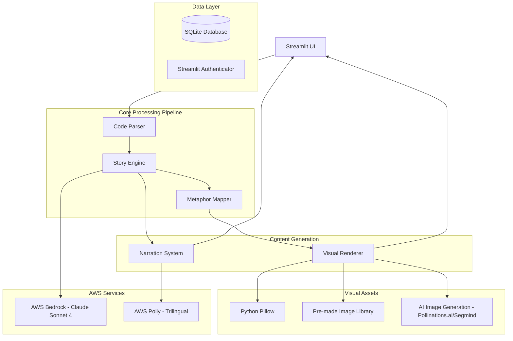

# CodeLeela Design Document

## Overview

CodeLeela ("Learn code through stories - programming made simple for Bharat") is an innovative educational platform that transforms programming concepts into engaging, culturally relevant stories for India's diverse learners. The system addresses the critical gap in programming education by using Indian cultural metaphors, trilingual support (Hindi, English, Gujarati), and visual storytelling to make coding accessible to absolute beginners.

The platform serves 100M+ Indians who want to learn programming but face language barriers and concept-focused learning gaps. By combining story-based learning with AI-powered personalization, CodeLeela builds programming intuition before introducing syntax, making learning engaging and memorable through familiar cultural contexts.

**Target Users**: Absolute beginners (students from school/college with ), professionals non-CS backgrounds,students from tier 2/3 cities, Hindi/Gujarati speaking learners, educators and NGOs, and self-learners seeking intuitive programming education.

**Target Coverage**: From basic programming concepts (variables, arrays, loops, data types) to intermediate DSA topics (stacks, linked lists, recursion, trees), ensuring comprehensive learning progression for absolute beginners to intermediate learners.

## How CodeLeela Stands Apart

| Feature | Traditional Platforms | CodeLeela |
|---------|----------------------|-----------|
| Language | English only | Hindi/English/Gujarati |
| Method | Syntax-first | Story-based |
| Examples | Generic/Western | Indian cultural metaphors |
| Topics | Basic only | Basics to Advanced DSA |
| Format | Text-heavy | Visual + Voice + Interactive |

## Key Design Decisions and Rationales

### Streamlit as Primary Frontend Framework
**Decision**: Use Streamlit instead of traditional web frameworks like React or Vue.js
**Rationale**: 
- Enables rapid prototyping and deployment with Python-native development
- Reduces complexity for educational platform development
- Built-in components perfect for interactive learning interfaces
- No JavaScript knowledge required, allowing focus on educational content
- Easy integration with Python-based AI/ML services

### Trilingual Support Architecture
**Decision**: Implement comprehensive trilingual support (Hindi, English, Gujarati) throughout the system
**Rationale**:
- Addresses the critical language barrier faced by 100M+ Indians wanting to learn programming
- Uses AWS Polly's Aditi voice for Hindi and Gujarati, ensuring cultural pronunciation accuracy
- Maintains educational value and cultural context across all three languages
- Supports India's linguistic diversity, particularly in tier 2/3 cities

### Hybrid Visual Generation Strategy
**Decision**: Combine pre-made visual library with AI-generated fallbacks
**Rationale**:
- Pre-made library ensures consistent visual style and fast rendering
- AI generation (Pollinations.ai, Segmind) provides coverage for edge cases
- Balances performance with comprehensive visual coverage
- Reduces dependency on external AI services while maintaining visual quality

### Cultural Metaphor-First Approach
**Decision**: Build extensive Indian cultural metaphor database as core system component
**Rationale**:
- Makes abstract programming concepts concrete through familiar cultural references
- Addresses the concept-focused learning gap in traditional programming education
- Incorporates diverse Indian cultural elements (festivals, mythology, daily life)
- Builds programming intuition before introducing syntax

### AWS Bedrock Integration for Story Generation
**Decision**: Use AWS Bedrock (Claude Sonnet 4) as primary AI service for story generation
**Rationale**:
- Advanced code analysis and understanding capabilities
- Superior cultural context awareness for Indian metaphor generation
- Reliable enterprise-grade service with appropriate fallback mechanisms
- Multi-language content adaptation capabilities

### Story-First Learning Methodology
**Decision**: Generate stories before showing code syntax
**Rationale**:
- Builds conceptual understanding before technical implementation
- Reduces cognitive load for absolute beginners
- Makes learning engaging and memorable through narrative
- Addresses high dropout rates in traditional syntax-focused tutorials

## Architecture

CodeLeela follows a modular, story-first architecture optimized for rapid development and deployment using Python-native technologies:



### Key Architectural Principles

1. **Python-Native Stack**: Streamlit frontend with Python 3.10+ backend for rapid prototyping and deployment
2. **Story-First Learning**: Builds intuition before syntax using Indian cultural metaphors
3. **Trilingual Support**: Native Hindi, English, Gujarati support throughout the system
4. **Hybrid Visual Generation**: Pre-made library with AI fallback for comprehensive visual coverage
5. **Cultural Adaptation**: Dedicated metaphor mapping for Indian cultural contexts
6. **Scalable Cloud Integration**: AWS services with local fallbacks for reliability

## Technology Stack

### Frontend Framework
**Streamlit (Python Web Framework)**
- Rapid prototyping and development
- Built-in components for educational interfaces
- Python-native (no JavaScript required for MVP)
- Easy deployment and scaling
- Interactive widgets for learning controls

### Backend/Core Processing
**Python 3.10+**
- Main programming language for all logic and processing
- Rich ecosystem for educational content processing
- AST parsing for code analysis
- Integration with AI/ML services

### AI/ML Services
**AWS Bedrock (Claude Sonnet 4)**
- Advanced code analysis and understanding
- Intelligent metaphor generation
- Culturally appropriate story creation
- Context-aware explanation generation
- Multi-language content adaptation

### Voice and Narration
**Amazon Polly - Trilingual Support**
- Hindi voice: Aditi (Neural voice)
- English voices: Joanna/Matthew (Neural voices)
- Gujarati voice: Aditi (Neural voice)
- High-quality text-to-speech synthesis
- Cultural pronunciation accuracy

### Image Processing and Visual Generation
**Python Pillow (PIL)**
- Image manipulation and composition
- Visual metaphor arrangement
- Text overlay and labeling
- Creating composite educational visuals

**Hybrid Visual Generation Strategy**
- **Primary**: Pre-made library with consistent style and fast rendering
- **Fallback**: AI Generation services
  - Pollinations.ai (Free, unlimited API)
  - Stable Diffusion via Hugging Face
  - Segmind (100 free generations/month)

### Database and Storage
**SQLite (MVP/Development)**
- Lightweight, file-based database
- No server setup required
- Perfect for educational content storage
- User progress tracking

### Authentication
**Streamlit-Authenticator (MVP)**
- Simple user management
- Educational institution integration ready

### Optional Scaling Components
- **AWS Lambda**: Serverless functions for processing
- **API Gateway**: REST API for mobile/web integration
- **DynamoDB**: NoSQL database for scale
- **CloudFront**: CDN for faster global delivery

## Components and Interfaces

### Educational Code Parser

**Purpose**: Analyzes code covering basic to intermediate programming concepts with focus on educational value and beginner-friendly explanations.

**Educational Topics Covered**:
- **Basic**: Variables, arrays, loops, data types, basic input/output
- **Intermediate**: Functions, conditionals, basic algorithms, string manipulation
- **Advanced DSA**: Stacks, linked lists, recursion, trees, basic sorting algorithms

**Key Responsibilities**:
- Parse Python code using AST with educational context awareness
- Identify learning opportunities and concept progression from basics to DSA topics
- Extract patterns suitable for cultural metaphor mapping
- Provide beginner-friendly error messages in trilingual format (Hindi/English/Gujarati)
- Maintain hierarchical relationships for nested constructs and algorithmic patterns
- Support progressive learning paths from absolute beginners to intermediate learners

**Interface**:
```python
class EducationalCodeParser:
    def parse_for_learning(self, source_code: str, user_level: str) -> LearningStructure
    def identify_concepts(self, ast_tree) -> List[ProgrammingConcept]
    def extract_learning_flow(self, ast_tree) -> List[LearningStep]
    def validate_for_beginners(self, source_code: str) -> TrilingualValidationResult
    def suggest_improvements(self, code_issues: List) -> List[LearningTip]
```

**Data Structures**:
```python
@dataclass
class LearningStructure:
    concepts: List[ProgrammingConcept]
    difficulty_level: str  # 'basic', 'intermediate', 'advanced'
    learning_flow: List[LearningStep]
    metaphor_opportunities: List[MetaphorOpportunity]
    cultural_context_hints: List[str]

@dataclass
class ProgrammingConcept:
    concept_type: str  # 'variable', 'array', 'loop', 'stack', 'linkedlist'
    complexity: str
    metaphor_category: str  # 'daily_life', 'sports', 'transport', 'family'
    learning_prerequisites: List[str]
```

### Story Engine

**Purpose**: Transforms parsed code structure into narrative elements using AI-powered story generation with Indian cultural context.

**Key Responsibilities**:
- Interface with AWS Bedrock (Claude Sonnet 4) for intelligent story generation
- Map code constructs to narrative elements using Indian cultural metaphors
- Build intuition before introducing syntax through story-first approach
- Generate culturally appropriate content incorporating festivals, mythology, family structures, and daily life scenarios
- Maintain story coherence and logical flow across basic to DSA topics
- Handle generation failures with graceful fallback to local story templates

**Interface**:
```python
class StoryEngine:
    def generate_story(self, code_structure: CodeStructure) -> Story
    def create_narrative_mapping(self, code_element) -> NarrativeElement
    def ensure_story_coherence(self, story: Story) -> Story
    def handle_generation_failure(self, error: Exception) -> Story
```

**AWS Bedrock Integration**:
```python
class BedrockClient:
    def __init__(self, model_id: str = "anthropic.claude-3-sonnet-20240229-v1:0")
    def generate_story_content(self, prompt: str, context: Dict) -> str
    def create_character_descriptions(self, variables: List[Variable]) -> List[Character]
    def generate_scene_descriptions(self, control_flow: ControlFlowNode) -> SceneDescription
```

### Metaphor Mapper

**Purpose**: Maps technical programming concepts to culturally relevant Indian metaphors and storytelling elements.

**Key Responsibilities**:
- Maintain database of diverse Indian cultural metaphors including festivals (Diwali, Holi), mythology (Ramayana, Mahabharata), family structures, and daily life scenarios
- Map programming constructs to specific cultural metaphors: linked lists as train compartments, arrays as cricket team lineups, variables as pots storing water, stacks as plate arrangements
- Ensure cultural sensitivity and accuracy across different Indian cultural backgrounds
- Provide fallback universal metaphors while maintaining cultural appropriateness
- Incorporate culturally appropriate visual designs, naming conventions, and behavioral patterns

**Interface**:
```python
class MetaphorMapper:
    def map_variable_to_character(self, variable: Variable) -> Character
    def map_function_to_action(self, function: Function) -> Action
    def map_loop_to_journey(self, loop: ControlFlowNode) -> Journey
    def map_conditional_to_decision(self, conditional: ControlFlowNode) -> Decision
    def get_cultural_context(self, concept: str) -> CulturalContext
```

**Metaphor Database Structure**:
```python
@dataclass
class MetaphorMapping:
    programming_concept: str
    cultural_metaphor: str
    description: str
    visual_elements: List[str]
    narrative_template: str
    cultural_context: str
```

### Visual Renderer

**Purpose**: Creates visual representations of story elements and code execution flow using Indian cultural metaphors.

**Key Responsibilities**:
- Render characters representing variables and functions using culturally appropriate designs
- Animate code execution through visual storytelling with specific metaphors (trains for linked lists, cricket teams for arrays)
- Create visual narratives showing data movement, transformations, and relationships
- Use hybrid visual generation combining pre-made library assets with AI-generated visuals from Pollinations.ai or Segmind
- Handle rendering failures gracefully with pre-made placeholder visuals
- Maintain visual consistency across programming concepts

**Interface**:
```python
class VisualRenderer:
    def render_story_scene(self, scene: SceneDescription) -> VisualScene
    def create_character_sprite(self, character: Character) -> Sprite
    def animate_execution_flow(self, execution_steps: List[ExecutionStep]) -> Animation
    def render_interactive_elements(self, story: Story) -> InteractiveElements
```

**Rendering Technology Stack**:
- **Primary Web Framework**: Streamlit for rapid UI development and deployment
- **Visualization**: Plotly for interactive visualizations and animations
- **2D Asset Rendering**: Pillow for image processing and character sprite creation
- **Styling**: Custom CSS integration with Streamlit for anime-style themes
- **Asset Storage**: Amazon S3 for storing and serving visual assets and animations

### Narration System

**Purpose**: Generates and delivers trilingual audio explanations using AWS Polly with cultural context preservation.

**Key Responsibilities**:
- Generate trilingual text explanations (Hindi, English, Gujarati) for each story segment
- Convert text to speech using AWS Polly with appropriate voices (Aditi for Hindi/Gujarati, Joanna/Matthew for English)
- Maintain story coherence and cultural appropriateness when switching between languages
- Handle audio streaming and playback with efficient streaming for diverse internet speeds
- Provide text-only explanations as fallback when audio generation fails
- Preserve educational value across all three supported languages

**Interface**:
```python
class NarrationSystem:
    def generate_trilingual_text(self, story_segment: StorySegment) -> TrilingualText
    def synthesize_speech(self, text: str, language: str) -> AudioStream
    def switch_language(self, current_language: str, target_language: str) -> str
    def stream_narration(self, audio: AudioStream) -> None
    def handle_audio_failure(self, text: str, language: str) -> TextOnlyExplanation
```

**AWS Polly Integration**:
```python
class PollyClient:
    def __init__(self):
        self.hindi_voice = "Aditi"  # Neural voice for Hindi
        self.gujarati_voice = "Aditi"  # Neural voice for Gujarati
        self.english_voice = "Joanna"  # Neural voice for English
    
    def synthesize_speech(self, text: str, language: str) -> bytes
    def get_available_voices(self, language: str) -> List[str]
    def configure_speech_parameters(self, rate: str, pitch: str) -> None
    def handle_polly_failures(self, error: Exception) -> None
```

### User Interface

**Purpose**: Provides Streamlit-based interactive interface for code input, story visualization, and user controls optimized for absolute beginners.

**Key Responsibilities**:
- Provide intuitive web-based interface using Streamlit's built-in components
- Accept Python code input with beginner-friendly validation
- Display visual story representations with smooth animations
- Provide playback and navigation controls (pause, replay, navigate through story segments)
- Handle trilingual language switching (Hindi, English, Gujarati)
- Allow toggling between story view and actual code view with detailed explanations
- Maintain responsive feedback and contextual help for absolute beginners
- Optimize performance for users in tier 2/3 cities with varying internet speeds

**Interface Components**:
- **Code Input Panel**: Syntax-highlighted code editor with beginner-friendly validation
- **Story Visualization Area**: Main display for animated stories with cultural metaphors
- **Control Panel**: Play, pause, replay, language toggle controls (Hindi/English/Gujarati)
- **Information Panel**: Code-to-story mapping explanations with contextual help
- **Language Selector**: Seamless switching between trilingual support
- **Progress Indicator**: Visual feedback for story generation and loading states

## Data Models

### Core Data Structures

```python
@dataclass
class Story:
    title: str
    scenes: List[Scene]
    characters: List[Character]
    narrative_flow: List[NarrativeStep]
    metadata: StoryMetadata

@dataclass
class Scene:
    scene_id: str
    description: str
    characters: List[Character]
    actions: List[Action]
    visual_elements: List[VisualElement]
    duration: float

@dataclass
class Character:
    name: str
    role: str  # variable, function, data_structure
    visual_design: CharacterDesign
    cultural_context: str
    personality_traits: List[str]

@dataclass
class CharacterDesign:
    appearance: str
    color_scheme: List[str]
    animation_style: str
    cultural_elements: List[str]

@dataclass
class TrilingualText:
    english: str
    hindi: str
    gujarati: str
    context: str
    cultural_notes: Optional[str]
    educational_level: str  # 'basic', 'intermediate', 'advanced'
```

### Configuration Models

```python
@dataclass
class SystemConfiguration:
    aws_region: str
    bedrock_model_id: str
    polly_voice_settings: PollySettings
    rendering_settings: RenderingSettings
    cultural_settings: CulturalSettings

@dataclass
class PollySettings:
    hindi_voice: str
    english_voice: str
    gujarati_voice: str
    speech_rate: str
    output_format: str

@dataclass
class CulturalSettings:
    primary_culture: str
    metaphor_preference: str
    visual_style: str
    narrative_complexity: str
```

## Correctness Properties

*A property is a characteristic or behavior that should hold true across all valid executions of a system—essentially, a formal statement about what the system should do. Properties serve as the bridge between human-readable specifications and machine-verifiable correctness guarantees.*

Based on the prework analysis and property reflection, the following properties ensure CodeLeela's correctness across all inputs and scenarios:

### Property 1: Code Analysis Completeness
*For any* valid Python code input, the Code_Parser should correctly identify and extract all control flows, variables, functions, data operations, and their logical relationships while maintaining hierarchical structure for nested constructs.
**Validates: Requirements 1.1, 1.2, 1.4**

### Property 2: Error Handling Consistency  
*For any* invalid input or service failure (code parsing, AWS services, rendering), the system should provide appropriate error messages, implement graceful fallback behavior, and maintain system stability while logging errors for improvement.
**Validates: Requirements 1.3, 2.4, 3.4, 4.4, 8.4**

### Property 3: Comprehensive Story Generation
*For any* parsed code structure, the Story_Engine should generate culturally relevant narratives that incorporate Indian cultural metaphors, maintain logical consistency with code execution flow, and accurately represent the code's behavior through storytelling elements.
**Validates: Requirements 2.1, 2.2, 2.3**

### Property 4: Visual Narrative Rendering
*For any* story elements, the Visual_Renderer should create anime-style character representations for all code constructs, animate execution flow through character interactions, and use appropriate visual metaphors for complex programming concepts.
**Validates: Requirements 3.1, 3.2, 3.3**

### Property 5: Trilingual Narration Support
*For any* story content, the Narration_System should generate accurate trilingual text explanations in Hindi, English, and Gujarati, produce high-quality speech using AWS Polly with appropriate voices, and maintain story coherence and cultural appropriateness when switching between languages.
**Validates: Requirements 4.1, 4.2, 4.3**

### Property 6: Interactive User Experience
*For any* story visualization, the User_Interface should provide functional playback controls, display detailed code explanations when interacting with visual elements, and allow seamless toggling between story and code views.
**Validates: Requirements 5.1, 5.2, 5.3**

### Property 7: Cultural Integration Consistency
*For any* code concept mapping, the Metaphor_Mapper should use appropriate Indian cultural elements (festivals, mythology, family structures, daily life), incorporate culturally appropriate visual designs and naming conventions, and provide universal metaphors as fallbacks while maintaining cultural sensitivity.
**Validates: Requirements 6.1, 6.2, 6.3, 6.4**

### Property 8: Educational Accessibility
*For any* generated explanation or educational content, the system should avoid technical programming terminology, break down complex concepts into simple story elements, and include contextual hints and learning tips to support non-coder understanding.
**Validates: Requirements 7.1, 7.2, 7.4**

### Property 9: AWS Service Integration
*For any* interaction with AWS services, the system should authenticate securely, handle API rate limits appropriately, manage service configurations correctly, and implement graceful degradation when services are unavailable.
**Validates: Requirements 8.1, 8.2, 8.3**

### Property 10: Content Quality Assurance
*For any* generated content, the system should ensure narrative accuracy reflects actual code behavior, maintain consistent metaphor usage across similar programming concepts, provide accurate and culturally appropriate bilingual translations, and flag quality issues while providing alternative explanations.
**Validates: Requirements 10.1, 10.2, 10.3, 10.4**

## Performance and Accessibility Design

### Performance Optimization for Diverse Users
CodeLeela is designed to serve users across India, including those in tier 2/3 cities with varying internet speeds and device capabilities:

**Response Time Targets**:
- Code analysis and initial story generation: ≤10 seconds for typical code snippets
- Visual rendering: Smooth performance using Streamlit's built-in components and Pillow
- Audio narration: Efficient streaming with progressive loading to minimize waiting time
- UI interactions: Responsive feedback with clear loading indicators

**Optimization Strategies**:
- **Lazy Loading**: Visual assets and animations load progressively
- **Caching**: Pre-generated story templates and cultural metaphors for common patterns
- **Compression**: Optimized audio and visual assets for faster delivery
- **Graceful Degradation**: System prioritizes user interactions during high load

### Educational Accessibility
The platform is specifically designed for absolute beginners with no programming background:

**Language Accessibility**:
- Avoid technical programming terminology in explanations
- Use everyday language appropriate for school/college students and non-CS professionals
- Provide scaffolded learning with progressive disclosure from basics to advanced topics

**Learning Support Features**:
- Contextual hints and learning tips throughout the interface
- Beginner-friendly error messages with learning suggestions
- Visual cues and encouragement for exploration without fear of mistakes
- Progressive complexity from basic concepts to DSA topics

**Cultural Accessibility**:
- Diverse Indian cultural elements to resonate with learners from different backgrounds
- Culturally appropriate visual designs and naming conventions
- Universal metaphors as fallbacks while maintaining cultural sensitivity

## Error Handling

CodeLeela implements comprehensive error handling across all system components to ensure robust operation and graceful degradation:

### Code Parsing Errors
- **Syntax Errors**: Provide detailed error messages with line numbers and suggestions
- **Unsupported Constructs**: Gracefully handle advanced Python features not yet supported
- **Large Code Files**: Implement size limits and provide chunking for large inputs

### AWS Service Errors
- **Bedrock Failures**: Fall back to local story templates while maintaining narrative quality
- **Polly Failures**: Provide text-only explanations with retry mechanisms
- **Rate Limiting**: Implement exponential backoff and request queuing
- **Authentication Issues**: Clear error messages and configuration guidance

### Rendering Errors
- **Animation Failures**: Display static visuals with placeholder animations
- **Resource Loading**: Implement lazy loading and fallback assets
- **Browser Compatibility**: Graceful degradation for unsupported features

### Cultural Content Errors
- **Missing Metaphors**: Fall back to universal metaphors with cultural sensitivity
- **Translation Failures**: Provide English-only content with error notifications
- **Cultural Appropriateness**: Content review flags and alternative suggestions

## Testing Strategy

CodeLeela employs a dual testing approach combining unit tests for specific scenarios and property-based tests for comprehensive coverage:

### Unit Testing Focus
- **Specific Examples**: Test known code patterns and their expected story outputs
- **Edge Cases**: Handle empty code, single-line scripts, and complex nested structures
- **Integration Points**: Verify AWS service integration with mock responses
- **Error Conditions**: Test specific failure scenarios and recovery mechanisms
- **Cultural Content**: Validate specific metaphor mappings and cultural references

### Property-Based Testing Configuration
- **Testing Library**: Use Hypothesis for Python property-based testing
- **Iteration Count**: Minimum 100 iterations per property test for thorough coverage
- **Test Tagging**: Each property test references its design document property
- **Tag Format**: **Feature: CodeLeela, Property {number}: {property_text}**

### Property Test Implementation
Each correctness property will be implemented as a single property-based test:

1. **Property 1 Test**: Generate random Python code snippets and verify complete analysis
2. **Property 2 Test**: Inject various failure conditions and verify error handling
3. **Property 3 Test**: Generate diverse code structures and verify story quality
4. **Property 4 Test**: Test visual rendering across different story elements
5. **Property 5 Test**: Verify trilingual support across various content types
6. **Property 6 Test**: Test UI interactions across different story configurations
7. **Property 7 Test**: Verify cultural integration across programming concepts
8. **Property 8 Test**: Test educational accessibility across complexity levels
9. **Property 9 Test**: Test AWS integration under various conditions
10. **Property 10 Test**: Verify content quality across different scenarios

### Testing Infrastructure
- **Mock Services**: AWS service mocks for reliable testing
- **Test Data Generation**: Automated Python code generation for diverse test cases
- **Cultural Content Validation**: Automated checks for cultural appropriateness
- **Performance Benchmarks**: Baseline performance metrics for regression testing
- **Accessibility Testing**: Automated checks for educational accessibility standards

### Content Quality Assurance
CodeLeela implements comprehensive quality assurance to ensure educational effectiveness and cultural appropriateness:

**Narrative Accuracy**:
- Automated validation that generated stories accurately reflect actual code behavior and logic
- Cross-verification between code execution flow and story narrative progression
- Quality flags for inconsistencies between programming concepts and their story representations

**Cultural Appropriateness**:
- Content review system for cultural sensitivity across different Indian backgrounds
- Validation of metaphor accuracy and cultural context appropriateness
- Community feedback integration for continuous cultural relevance improvement

**Educational Effectiveness**:
- Consistent metaphor usage across similar programming concepts (trains for linked lists, cricket teams for arrays)
- Progressive learning validation from basic concepts to advanced DSA topics
- Translation accuracy verification across Hindi, English, and Gujarati content

**Quality Monitoring**:
- Automated detection of content quality issues with alternative explanation generation
- User feedback integration for continuous improvement of cultural metaphor database
- Performance metrics tracking for educational outcomes and user engagement

### AI-Assisted Development
CodeLeela development leverages AI assistance to accelerate implementation and ensure best practices:

- **Amazon Q Developer**: Used throughout the project to assist in writing AST parsing logic, managing AWS Boto3 integrations, and providing code suggestions for complex Python constructs
- **Code Generation**: AI-assisted generation of boilerplate code for AWS service integrations and Streamlit components
- **Best Practices**: AI guidance for implementing secure AWS authentication, efficient AST traversal, and optimal Streamlit performance patterns
- **Documentation**: AI assistance in generating comprehensive code documentation and inline comments for maintainability